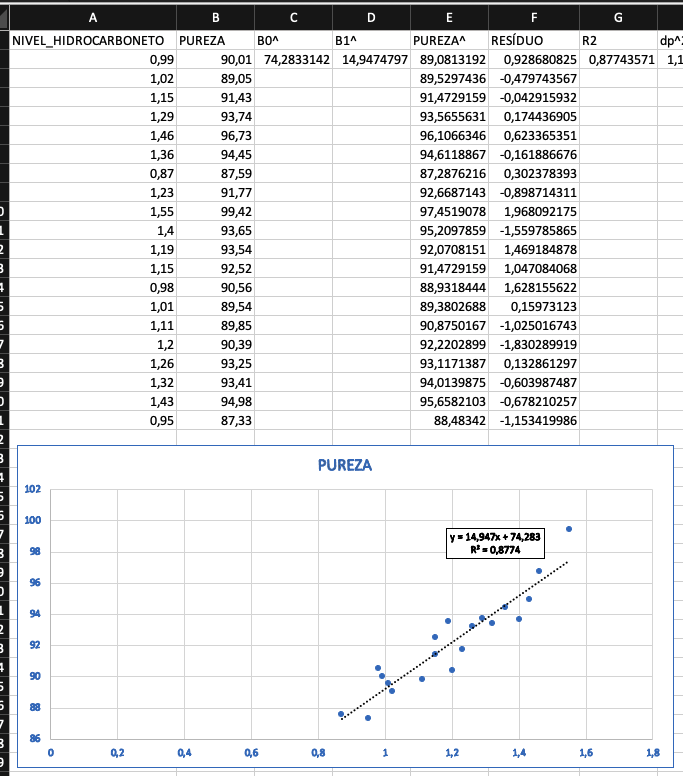
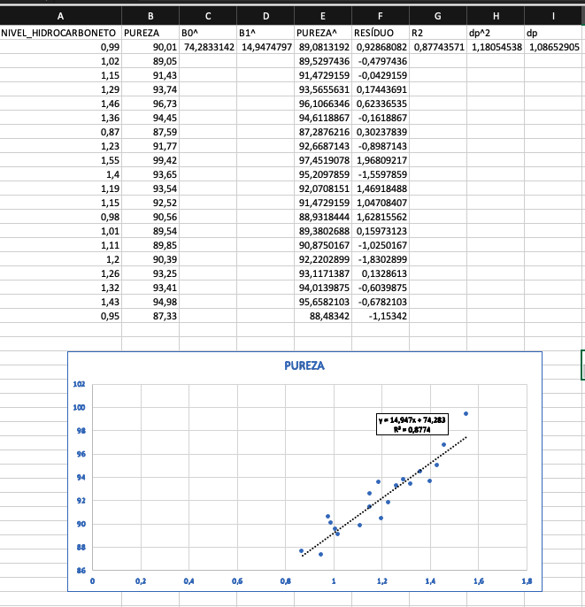
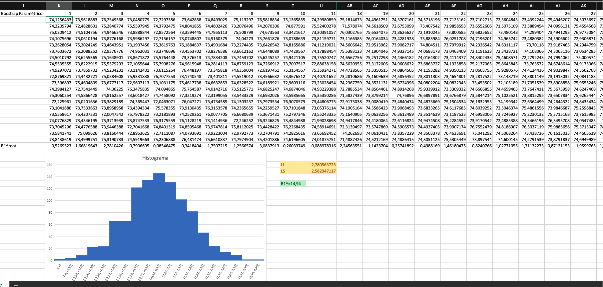
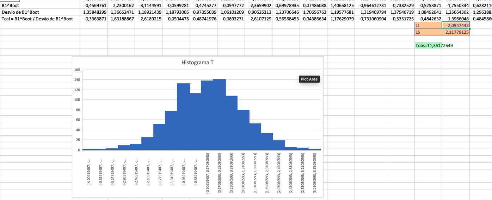
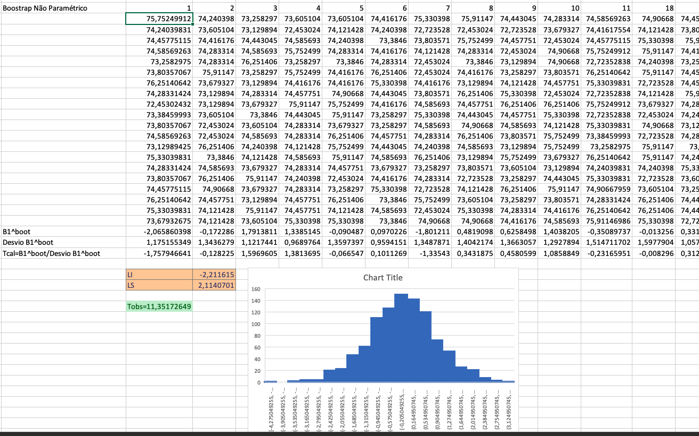

# Bootstrap Paramétrico (Excel): Nível de Hidrocarboneto x Pureza 
Plotando um gráfico de relação dispersão entre as variáves Nível de Hidrocarboneto e pureza com uma linha de dentência observamos na Figura abaixo um relação linear entre as duas variáveis.

Logo:

$$\begin{array}{ccc}
H_0: \beta1 = 0 \\
H_0: \beta1  \neq 0 
\end{array}$$

E considerando que os nossos dados seguem um modelo de regressão linear, temos:

$$PUREZA = \beta0 + \beta1*NIVEL\_HIDROCARBONETO + ERRO$$
Onde erro é:

$$ERRO \thicksim N(0;\sigma^2)$$

Para estimar as variáveis $\widehat{\beta}0$ e $\widehat{\beta}1$ iremos utilizar o método dos mínimos quadrados de modo a minimizar a soma dos quadrados dos desvios verticais.

No **EXCEL** usaremos as seguintes fórmulas:

$$
\widehat{\beta}0 = INTERCEPT(B2:B21;A2:A21) = 74,28331424 \\
\widehat{\beta}1 = SLOPE(B2:B21;A2:A21) = 14,94747973
$$

Logo: 

$$\widehat{PUREZA} = 74,28331424 + 14,94747973*NIVEL\_HIDROCARBONETO$$

E

$$RESÍDUO = Y - \widehat{Y}$$

E

$$
\sigma^2 = (\sum r_i^2) / n - 2 = 1,180545382 \\ 
\sigma = \sqrt{\sigma^2} = 1,086529053
$$

Onde $r_i$ = é o resíduo de cada amostra e $n$ é a quantidade de amostras.

**Calculando o Bootstrap Parmétrico, temos:**

A fórmula usada para realizar as simulações foi:

$\$C\$2 + NORM.INV(RAND();0;\$I\$2)$, onde \$C\$2 é $\widehat{\beta}0 = 74,28331424$ e \$I\$2 é o desvio padrão do resíduo ($\sigma = 1,086529053$).

Em seguida foi calculado o valor do $\widehat{\beta}1 root$ usando a fórmula $SLOPE(K2:K21;\$A\$2:\$A\$21)$

E por fim, plotamos o histograma desses valores e calculamos os Limites inferiores e superiores, com as fórmulas:

* LI: $PERCENTILE.EXC(K22:ALV22;0,025) = -2,780563725$
* LS: $PERCENTILE.EXC(K22:ALV22;0,975) = 2,582947117$

Como $\widehat{\beta}1 = 14,94747973 > LS (2,582947117)$ **rejeito** $H_0: \beta1 = 0 \\$ ao nível de confiança de 95\%, ou seja, existe uma relação linear entre o **nível de hidrocarboneto** e a **pureza** do oxigênio.

Usualmente ao invés de usarmos $\widehat{\beta}1$ para comparar com os percentis 2,5\% e 97,5\% (confiança de 95\%) optamos por usar 

$T_obs = \widehat{\beta}1 / desvio(\widehat{\beta}1) = 14,94747973/1,31675827 = 11,35172649$

Quando dividimos todos os $\widehat{\beta}1Boot$  pelo desvio (cada amostra pelo seu desvio) o histograma terá a forma de uma distribuição T com $n-2$ graus de liberdade.
 

Observamos que:

* LI: $PERCENTILE.EXC(N24:ALV24;0,025) = -2,038492075$
* LS: $PERCENTILE.EXC(N24:ALV24;0,975) = 2,170661501$

Como $T_obs (11,35172649) > LS (2,170661501)$ então **rejeito** $H_0: \beta1 = 0$ ao nível de 95\%.

# Bootstrap Não Paramétrico (Excel): Nível de Hidrocarboneto x Pureza 

Observe que nossas análises anteriores usamos a hipótese de que os resíduos são normais (indicativo que o erro é normal). E se os resíduos não forem normais então teremos que usar \textcolor{red}{red}**Bootstrap Não Paramétrico**.

Isto significa que não podemos usar no Excel a normalidade dos Resíduos:

$$=\$C\$2 + NORM.INV(RAND();0;\$I\$2)$$

Temos que substituir $NORM.INV(RAND();0;\$I\$2)$ por uma amostra aleatória com reposição da coluna dos resíduos.

Considerando os resíduos na coluna F, então temos:

$=\$C\$2+OFFSET(\$F\$2;RANDBETWEEN(1;20);0)$, onde $\$C\$2 = \beta0 = 74,28331424$

Como $T_obs (11,35172649) > LS (2,114070065) $ então Rejeitamos H_0: beta1 = 0 ao nível de 5\% de significância ou confiança de 95\%. p-value calculado foi de 0,0000000012.

Ver imagem abaixo:

