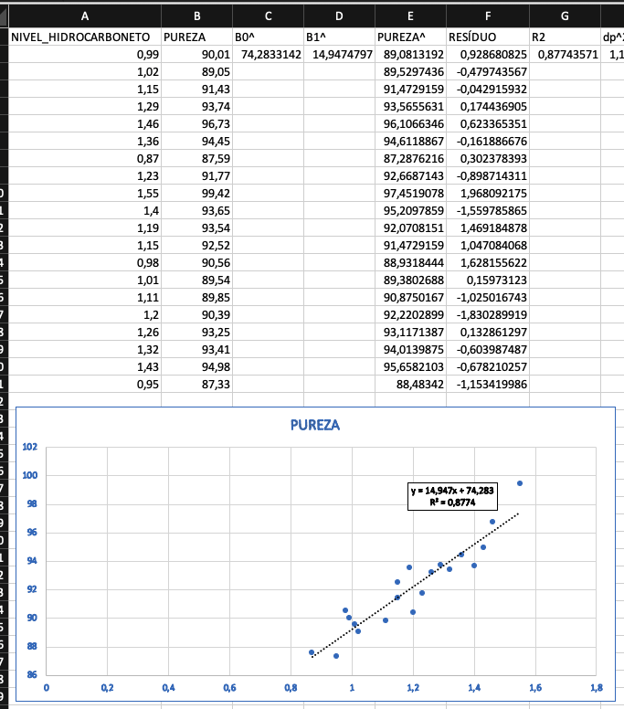

# Bootstrap Paramétrico (Excel): Nível de Hidrocarboneto x Pureza 
Plotando um gráfico de relação dispersão entre as variáves Nível de Hidrocarboneto e pureza com uma linha de dentência observamos na Figura abaixo um relação linear entre as duas variáveis.

Logo:

$$\begin{array}{ccc}
H_0: \beta1 = 0 \\
H_0: \beta1  \neq 0 
\end{array}$$

E considerando que os nossos dados seguem um modelo de regressão linear, temos:

$$PUREZA = \beta0 + \beta1*NIVEL\_HIDROCARBONETO + ERRO$$

Logo:

$$\begin{array}{ccc}
H_0: \beta1 = 0 \\
H_0: \beta1  \neq 0 
\end{array}$$

E considerando que os nossos dados seguem um modelo de regressão linear, temos:

$$PUREZA = \beta0 + \beta1*NIVEL\_HIDROCARBONETO + ERRO$$

Onde erro:

$$ERRO \thicksim N(0;\sigma^2)$$

Para estimar as variáveis $\widehat{\beta}0$ e $\widehat{\beta}1$ iremos utilizar o método dos mínimos quadrados de modo a minimizar a soma dos quadrados dos desvios verticais.

No **EXCEL** usaremos as seguintes fórmulas:

$$
\widehat{\beta}0 = INTERCEPT(B2:B21;A2:A21) = 74,28331424 \\
\widehat{\beta}1 = SLOPE(B2:B21;A2:A21) = 14,94747973
$$

Logo: 

$$\widehat{PUREZA} = 74,28331424 + 14,94747973*NIVEL\_HIDROCARBONETO$$

E

$$RESÍDUO = Y - \widehat{Y}$$

E

